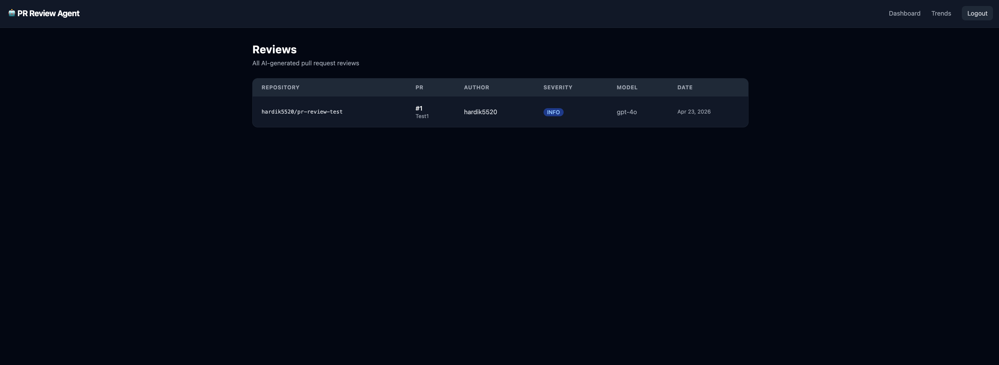
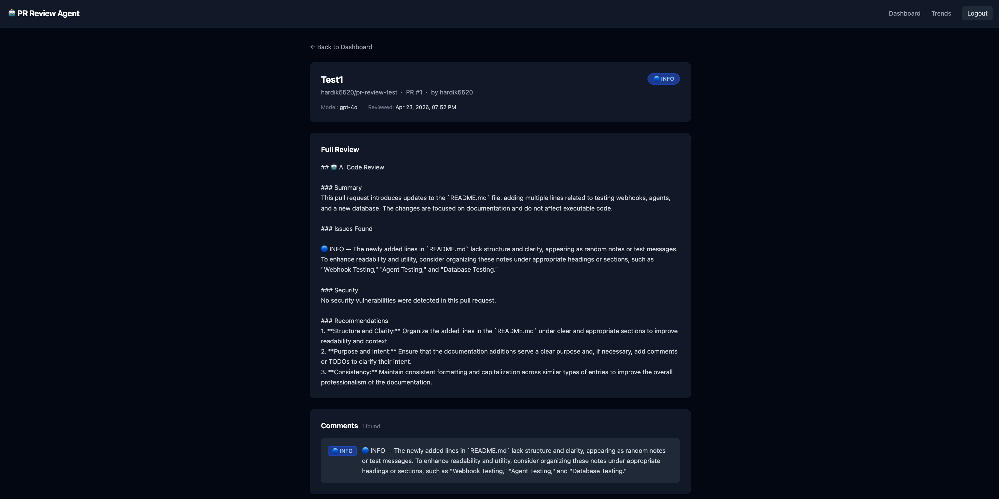
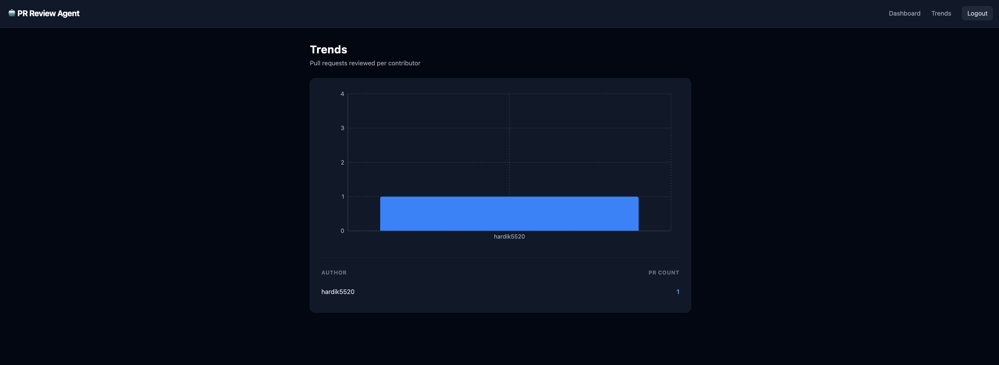
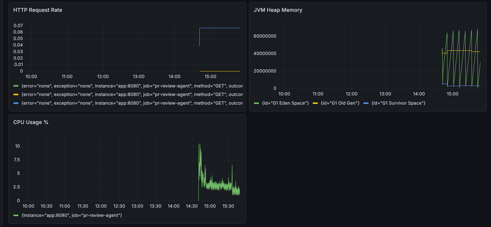

# 🤖 AI PR Review Agent

An autonomous AI-powered pull request reviewer built with Spring Boot, LangGraph4j, and GPT-4o.
When a pull request is opened or updated on GitHub, the agent automatically reviews the code,
checks for security vulnerabilities, and posts a detailed review comment directly on the PR —
all without any human intervention.

---

## 📸 Screenshots

### Dashboard — All Reviews


### Review Detail — Full AI Review + Comments


### Trends — PRs per Contributor


### Grafana — Live Metrics


---

## 🏗️ Architecture

```
GitHub PR opened/updated
        │
        ▼
  Webhook (POST /webhook/github)
  HMAC-SHA256 signature validation
        │
        ▼
  LangGraph4j Agent Pipeline
  ┌─────────────────────────────┐
  │  ParseDiff                  │  Split raw diff into per-file sections
  │      ↓                      │
  │  AnalyzeCode                │  GPT-4o general code review
  │      ↓                      │
  │  SecurityCheck              │  GPT-4o OWASP Top 10 security scan
  │      ↓                      │
  │  GenerateReview             │  Combine findings into structured review
  │      ↓                      │
  │  PostComment                │  Save to DB + post to GitHub PR
  └─────────────────────────────┘
        │
        ▼
  React Dashboard
  JWT-authenticated UI to browse all reviews, comments, and contributor trends
        │
        ▼
  Prometheus + Grafana
  Real-time metrics: request rate, JVM memory, CPU usage
```

---

## 🛠️ Tech Stack

### Backend
| Technology | Purpose |
|---|---|
| Java 21 + Spring Boot 3.3 | Core application framework |
| LangGraph4j | Agentic workflow graph (directed multi-step AI pipeline) |
| Spring AI + GPT-4o | LLM integration for code analysis |
| Spring Data JPA + PostgreSQL | Persistence layer |
| Spring Security + JWT | Stateless authentication |
| Spring Boot Actuator + Micrometer | Metrics exposure |

### Frontend
| Technology | Purpose |
|---|---|
| React 18 + Vite | UI framework and build tool |
| React Router | Client-side routing |
| Tailwind CSS | Utility-first styling |
| Recharts | Bar chart for contributor trends |

### Infrastructure
| Technology | Purpose |
|---|---|
| Docker + Docker Compose | Container orchestration |
| Prometheus | Metrics scraping and storage |
| Grafana | Metrics visualization |
| ngrok | Local webhook tunnel for development |

---

## ✨ Features

- **Automatic code review** — triggered by GitHub webhook on PR open/update
- **Security scanning** — checks for OWASP Top 10 vulnerabilities in every diff
- **Severity classification** — 🔴 CRITICAL / 🟡 WARNING / 🔵 INFO
- **GitHub integration** — posts the full review as a PR comment automatically
- **JWT-authenticated dashboard** — browse all reviews, read full AI output, see per-file comments
- **Contributor trends** — bar chart showing PRs reviewed per author
- **Real-time observability** — Prometheus metrics + Grafana dashboards for HTTP rate, JVM memory, CPU

---

## 🚀 Getting Started

### Prerequisites
- Java 21
- Maven
- Docker + Docker Compose
- GitHub account + Personal Access Token
- OpenAI API key
- ngrok (for local webhook testing)

### 1. Clone the repo
```bash
git clone https://github.com/YOUR_USERNAME/ai-pr-review-agent.git
cd ai-pr-review-agent
```

### 2. Configure secrets
Create `src/main/resources/application.yml` (this file is gitignored):

```yaml
spring:
  datasource:
    url: jdbc:postgresql://localhost:5432/pr_review
    username: admin
    password: admin
  jpa:
    hibernate:
      ddl-auto: update
    show-sql: true

server:
  port: 8080

github:
  webhook-secret: YOUR_WEBHOOK_SECRET
  token: YOUR_GITHUB_PAT

spring.ai.openai:
  api-key: YOUR_OPENAI_API_KEY
  chat.options.model: gpt-4o

jwt:
  secret: YOUR_JWT_SECRET_MIN_32_CHARS
  expiration: 86400000

management:
  endpoints:
    web:
      exposure:
        include: health,prometheus
  metrics:
    export:
      prometheus:
        enabled: true
```

### 3. Start with Docker Compose
```bash
docker-compose up --build
```

This starts:
- Spring Boot app on `http://localhost:8080`
- PostgreSQL on `localhost:5432`
- Prometheus on `http://localhost:9090`
- Grafana on `http://localhost:3000` (admin/admin)

### 4. Start the frontend
```bash
cd frontend
npm install
npm run dev
```
Frontend runs on `http://localhost:5173`

### 5. Set up GitHub webhook
```bash
# Start ngrok tunnel
ngrok http 8080
```

In your GitHub repo → Settings → Webhooks → Add webhook:
- **Payload URL:** `https://YOUR_NGROK_URL/webhook/github`
- **Content type:** `application/json`
- **Secret:** same value as `github.webhook-secret` in your yml
- **Events:** Pull requests only

### 6. Test it
Open a pull request in your test repo. Within seconds:
- The agent runs the full review pipeline
- A review comment appears on the PR
- The review shows up in the dashboard at `http://localhost:5173`

---

## 📊 Grafana Setup

1. Open `http://localhost:3000` → login with `admin/admin`
2. Connections → Data sources → Add → Prometheus
3. URL: `http://prometheus:9090` → Save & test
4. Create a new dashboard with these panels:

| Panel | Query |
|---|---|
| HTTP Request Rate | `rate(http_server_requests_seconds_count[1m])` |
| JVM Heap Memory | `jvm_memory_used_bytes{area="heap"}` |
| CPU Usage % | `system_cpu_usage * 100` |

---

## 🗂️ Project Structure

```
ai-pr-review-agent/
├── src/main/java/com/example/demo/
│   ├── agent/          # LangGraph4j nodes (ParseDiff, AnalyzeCode, SecurityCheck, GenerateReview, PostComment)
│   ├── api/            # REST controllers + DTOs for dashboard
│   ├── auth/           # JWT utility, filter, security config, login endpoint
│   ├── config/         # Spring AI ChatClient bean
│   ├── github/         # GitHub API client (fetch diff, post comment)
│   ├── review/         # JPA entities + repositories (PullRequest, Review, ReviewComment)
│   └── webhook/        # Webhook controller + HMAC-SHA256 signature validator
├── frontend/           # React dashboard (Vite + Tailwind + Recharts)
│   └── src/
│       ├── api/        # Fetch wrapper with JWT auto-attach
│       ├── components/ # Navbar
│       └── pages/      # Login, Dashboard, ReviewDetail, Trends
├── prometheus.yml      # Prometheus scrape config
├── docker-compose.yml  # All services: app + postgres + prometheus + grafana
└── Dockerfile          # Multi-stage build for Spring Boot app
```

---

## 🔒 Security Notes

- Webhook requests are validated with HMAC-SHA256 using a shared secret
- Dashboard is protected with JWT — login required to view any data
- All secrets are externalized via `application.yml` (gitignored) — never committed
